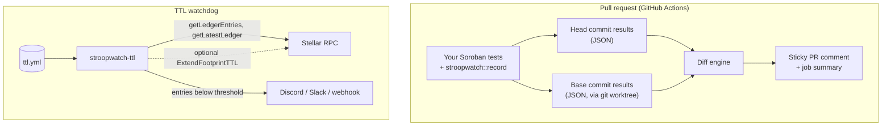
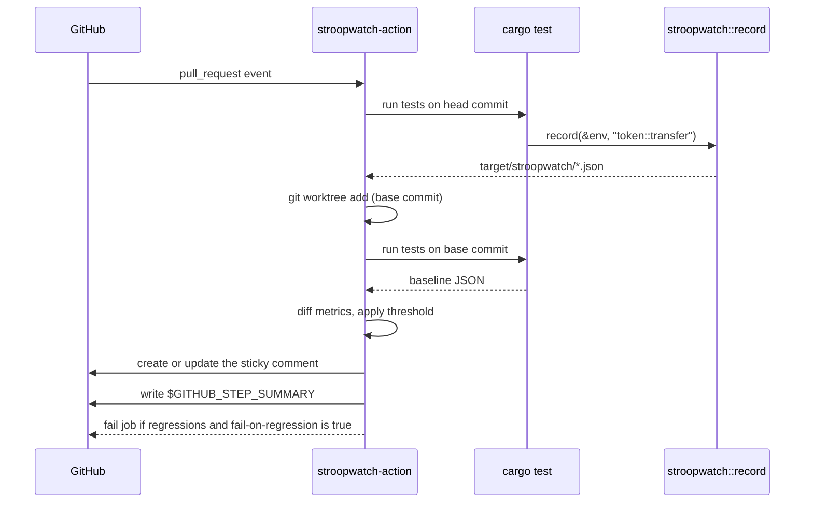

# Stroopwatch [](https://github.com/<org>/stroopwatch/actions/workflows/ci.yml) [](LICENSE) [](https://www.rust-lang.org/) [](https://www.typescriptlang.org/)

Catch Soroban resource-cost regressions in pull requests, and never lose contract state to archival.

## Overview

Soroban contracts pay for what they use: CPU instructions, memory, ledger reads and writes, and storage. Two problems follow from that, and both usually go unnoticed until users are affected:

1. **Cost creep.** A refactor, a dependency bump, or an extra storage read can make a contract function noticeably more expensive. Without measurement, nobody sees it in code review.
2. **State archival.** Contract storage has a time-to-live (TTL). Instances, code, and persistent data that are not extended in time are archived and must be restored before the contract works again.

Stroopwatch is a toolkit with one tool for each problem:

- **`stroopwatch-action`**: a GitHub Action that measures your contract functions' resource costs in your existing tests, compares them against the base branch, and posts a before/after table on every pull request.
- **`stroopwatch-ttl`**: a watchdog CLI that monitors the TTL of chosen contract entries, alerts you before they expire, and can optionally extend them automatically.

The name comes from the stroop, the smallest unit of XLM: Stroopwatch measures costs down to the stroop.

**Who it is for:**

- **Contract teams** who want cost regressions caught in review, like test failures.
- **Protocol operators** running contracts in production who cannot afford an unexpected archival.
- **Auditors and reviewers** who want objective cost data attached to every change.

**Design principles:**

- **Zero infrastructure.** The action needs no external storage, and the watchdog can run as a scheduled GitHub Actions workflow.
- **No noise.** Only changes above a configurable threshold are flagged, and one comment is updated in place instead of a new comment per push.
- **Safe with keys.** The watchdog only needs a key for automatic extension, reads it from the environment only, and never logs it.

### System Architecture



### Pull Request Flow



## Components

| Component | Path | Description | Distribution |
|---|---|---|---|
| Recorder | `crates/stroopwatch` | Rust test helper that writes a function's measured costs to JSON | crates.io (`stroopwatch`) |
| Action | `packages/action` | GitHub Action that measures both branches, diffs them, and reports | GitHub Marketplace (`<org>/stroopwatch@v0`) |
| TTL watchdog | `packages/ttl` | CLI that monitors, alerts on, and extends contract entry TTLs | npm (`stroopwatch-ttl`), GHCR Docker image |
| Examples | `examples/` | Sample contract, workflows, and configs used by the end-to-end tests | — |

## Architecture

### Recorder (`crates/stroopwatch`)

A dev-dependency with one main function. After a contract call in a test, `record` reads the cost estimate of the last invocation from the Soroban test environment and writes it as JSON:

```json
{
  "name": "token::transfer",
  "cpu_insns": 1204331,
  "mem_bytes": 831488,
  "read_entries": 3,
  "write_entries": 2,
  "read_bytes": 1520,
  "write_bytes": 412,
  "fee_stroops": 61020
}
```

Files are written to `$STROOPWATCH_OUT/<name>.json` (default: `target/stroopwatch/`). Recording the same name twice in one run is an error rather than a silent overwrite.

These numbers are estimates from the Soroban test environment. They track the direction and size of changes reliably, but they are not guaranteed to equal the fees charged on the network.

### Action (`packages/action`)

1. Runs `cargo test` in `working-directory` on the pull request's head commit and collects the JSON files.
2. Checks out the base commit in a separate `git worktree`, runs the same tests, and collects the baseline.
3. Computes the absolute and percentage change for every metric of every function. A function is flagged when CPU instructions or fee rise by more than `threshold-percent`.
4. Renders a markdown table sorted by largest regression, with rows for new and removed functions and a collapsed section containing every metric.
5. Creates or updates a single pull request comment, identified by a hidden `<!-- stroopwatch -->` marker, and writes the same table to the job summary.

If the base branch has no measurements yet, every function is shown as new and nothing fails. Pull requests from forks receive a read-only token; in that case the action skips the comment with a warning and still writes the job summary.

### TTL watchdog (`packages/ttl`)

For each target in `ttl.yml`, the watchdog builds the ledger keys for the contract **instance**, the contract **code** (using the Wasm hash read from the instance), and any extra persistent keys you list. It fetches them in batches from Stellar RPC and compares each entry's `liveUntilLedgerSeq` with the latest ledger to compute how many ledgers remain and roughly how long that is, based on recent ledger close times.

| Status | Meaning |
|---|---|
| `ok` | Ledgers remaining are at or above `warnBelowLedgers` |
| `warn` | Ledgers remaining are below `warnBelowLedgers` |
| `missing/archived` | The entry was not found; it may have been archived and need restoring |

With `--extend`, the watchdog builds one `ExtendFootprintTTL` transaction covering every entry at `warn`, extends them to `extendToLedgers` (capped at the network maximum), signs it with `KEEPER_SECRET`, submits it, and reports the transaction hash. Archived entries are reported but not restored automatically.

## Getting Started

### Prerequisites

| Tool | Needed for | Install |
|---|---|---|
| Rust (stable) | Recorder, your contract tests | `curl --proto '=https' --tlsv1.2 -sSf https://sh.rustup.rs \| sh` |
| Node.js LTS (22+) | TTL watchdog, developing the action | [nodejs.org](https://nodejs.org/) |
| pnpm | Developing this repository | `corepack enable` |
| Docker (optional) | Running the watchdog as a container | [docs.docker.com](https://docs.docker.com/get-docker/) |

### 1. Record costs in your tests

Add the recorder as a dev-dependency:

```toml
# Cargo.toml
[dev-dependencies]
stroopwatch = "0.1"
```

Call `record` after each contract call you want to track:

```rust
#[test]
fn transfer_cost() {
    let env = Env::default();
    // ... register the contract, create clients, mint ...
    client.transfer(&alice, &bob, &100);
    stroopwatch::record(&env, "token::transfer");
}
```

### 2. Add the action to your workflow

```yaml
# .github/workflows/stroopwatch.yml
name: Stroopwatch
on: pull_request

permissions:
  contents: read
  pull-requests: write

jobs:
  costs:
    runs-on: ubuntu-latest
    steps:
      - uses: actions/checkout@v4
        with:
          fetch-depth: 0          # needed to check out the base commit
      - uses: dtolnay/rust-toolchain@stable
      - uses: <org>/stroopwatch@v0
        with:
          working-directory: contracts
          threshold-percent: 5
          fail-on-regression: true
```

### Action inputs and outputs

| Input | Default | Description |
|---|---|---|
| `working-directory` | `.` | Directory where `cargo test` runs |
| `threshold-percent` | `5` | Percentage increase in CPU instructions or fee that counts as a regression |
| `fail-on-regression` | `false` | Fail the job when any regression is found |
| `github-token` | `${{ github.token }}` | Token used to post the pull request comment |

| Output | Description |
|---|---|
| `regressions` | Number of functions flagged as regressions |
| `report-path` | Path to the generated markdown report |

### 3. Set up the TTL watchdog

Create `ttl.yml`:

```yaml
rpcUrl: https://soroban-testnet.stellar.org
network: testnet
warnBelowLedgers: 100000
extendToLedgers: 500000        # optional; used only with --extend
targets:
  - name: my-dex
    contractId: C...
    include: [instance, code]
    keys:
      - { type: symbol, value: Config }
alerts:
  - type: discord
    url: ${DISCORD_WEBHOOK_URL}
  - type: slack
    url: ${SLACK_WEBHOOK_URL}
```

Run it:

```bash
npx stroopwatch-ttl check --config ttl.yml                     # report and alert
npx stroopwatch-ttl check --config ttl.yml --json              # machine-readable output
KEEPER_SECRET=S... npx stroopwatch-ttl check --config ttl.yml --extend --dry-run
KEEPER_SECRET=S... npx stroopwatch-ttl check --config ttl.yml --extend
```

| Exit code | Meaning |
|---|---|
| `0` | All entries are `ok` |
| `1` | At least one entry is at `warn` or `missing/archived` |
| `2` | The watchdog itself failed (bad config, RPC unreachable) |

### Developing this repository

```bash
git clone https://github.com/<org>/stroopwatch.git
cd stroopwatch
pnpm install
cargo test            # recorder tests
pnpm test             # action and watchdog tests
pnpm build            # bundles the action into packages/action/dist
```

Run the live testnet tests for the watchdog (deploys the sample contract):

```bash
RUN_LIVE_TESTS=1 pnpm test
```

## Deployment

### The action

The action runs on GitHub's runners, so there is nothing to host. Pin `@v0` to receive compatible updates, or pin an exact version tag for full reproducibility.

### The watchdog as a scheduled GitHub Actions workflow (no servers)

Copy `examples/ttl-cron.yml` into `.github/workflows/`. It runs every six hours and on demand:

```yaml
on:
  schedule:
    - cron: "0 */6 * * *"
  workflow_dispatch:

jobs:
  ttl:
    runs-on: ubuntu-latest
    steps:
      - uses: actions/checkout@v4
      - run: npx stroopwatch-ttl check --config ttl.yml --extend
        env:
          KEEPER_SECRET: ${{ secrets.KEEPER_SECRET }}
          DISCORD_WEBHOOK_URL: ${{ secrets.DISCORD_WEBHOOK_URL }}
```

### The watchdog as a container

```bash
docker run --rm \
  -v "$PWD/ttl.yml:/config/ttl.yml:ro" \
  -e DISCORD_WEBHOOK_URL -e KEEPER_SECRET \
  ghcr.io/<org>/stroopwatch-ttl check --config /config/ttl.yml --extend
```

Schedule it with cron, a Kubernetes CronJob, or any scheduler your platform provides.

### Keeper account

Automatic extension needs a funded account to pay fees. Use a dedicated account that holds only enough XLM for extensions, never an admin or treasury key:

```bash
stellar keys generate keeper --network testnet --fund
stellar keys show keeper      # prints the secret; store it as KEEPER_SECRET
```

## Example Output

### Pull request comment

| Function | CPU instructions | Memory | Fee (stroops) | Change |
|---|---|---|---|---|
| `token::transfer` | 1,204,331 | 812 KB | 61,020 | ▲ 7.2% ⚠️ |
| `pool::swap` | 3,880,102 | 2.1 MB | 142,300 | ▼ 3.1% |
| `pool::deposit` | 2,010,944 | 1.4 MB | 98,450 | new |

### TTL report

```
target   entry               ledgers left   ~time left   status
my-dex   instance            412,300        ~23.9 days   ok
my-dex   code                88,120         ~5.1 days    warn
my-dex   persistent:Config   —              —            missing/archived
```

## Troubleshooting

**The action reports "no measurements found".**
Your tests are not calling `stroopwatch::record`, or they write to a different directory. Check that `STROOPWATCH_OUT` is unset or points inside `working-directory`.

**The action fails to check out the base commit.**
`actions/checkout` fetches only one commit by default. Set `fetch-depth: 0`.

**No comment appears on pull requests from forks.**
Fork pull requests get a read-only token, so the action cannot comment. The results are still in the job summary.

**Numbers change slightly between runs with no code change.**
Check whether your tests use random inputs or vary the ledger state between runs. Deterministic tests give deterministic measurements.

**The watchdog reports `missing/archived` for an entry you know exists.**
Confirm the contract ID, the network in `ttl.yml`, and, for extra keys, the key's type and value. If the entry really was archived, restore it with the Stellar CLI before it can be extended again.

**`--extend` fails with an insufficient balance error.**
The keeper account needs XLM to pay for the extension. Fund it and try again.

## FAQ

**Are the measured costs the real network fees?**
They are estimates from the Soroban test environment. They are reliable for spotting regressions, but the network may charge slightly different amounts.

**Does the action need any external storage or service?**
No. It measures the base commit itself using a git worktree.

**Does the watchdog need my contract's admin key?**
No. Anyone can pay to extend any entry's TTL. The keeper account only pays fees.

**Can I use the watchdog without automatic extension?**
Yes. Without `--extend`, it only reports and alerts, and it needs no key at all.

**Does it work on mainnet?**
Yes. Point `rpcUrl` at a mainnet RPC provider and set `network: mainnet`.

## Contributing

Contributions of every size are welcome, from new alert channels to improvements in the diff report.

1. Read [CONTRIBUTING.md](CONTRIBUTING.md) for setup, coding conventions, and the pull request process.
2. Pick an issue from the tracker or from [ROADMAP.md](ROADMAP.md). Issues labelled `good first issue` are a good starting point.
3. Make sure `cargo test`, `pnpm lint`, `pnpm typecheck`, and `pnpm test` pass, and that the committed `dist/` bundle is rebuilt, before opening a pull request.

Planned work includes a Telegram alert channel, baseline caching between runs, a per-function budget file, trend charts in the comment, automatic restoration of archived entries, and a GitLab CI port.

## Security

To report a vulnerability, follow [SECURITY.md](SECURITY.md). Please do not open a public issue.

## License

[Apache-2.0](LICENSE)
